# git 版本控制

Webstorm 内置多种版本控制工具支持，下面以最常用的 git 为例，讲解下在 Webstorm 中的版本控制工具的使用。

当 Webstorm 初始化工程时会自动查找与关联项目的版本库。

## git的使用

### 哪里查看当前所处的git分支？

留意界面右下角：

上图表明工程工作目录处于”kf1.3″分支下。

### 如何新建/查看/切换分支?

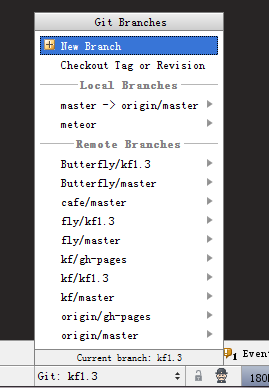

从图中可以看到本地分支/远程分支的情况，点击即可切换。

可以点击“new branch”来创建个新的分支（本地分支）。

当然你可以从指定的“tag”和指定的版本中拉取代码。

### 如何查看工作目录代码与版本库代码的差异？

代码编写界面左侧，可以看到当前工作目录代码与最近版本库代码的差异。

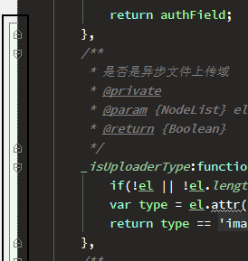

**如何跟指定版本比较呢？**

右击代码界面任意区域，选择“git”

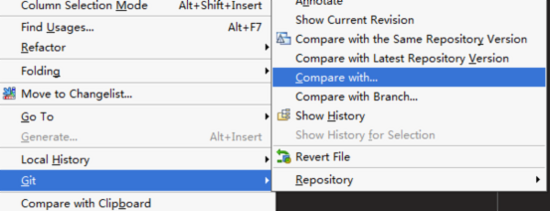

选择要进行比较的版本：

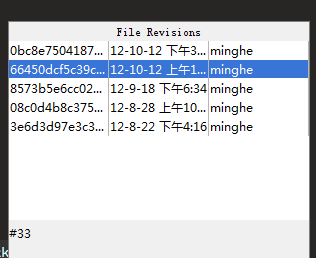

最后会弹出二栏比较的窗口。

当然你也可以选择与分支的代码进行比较。

### 如何回滚代码？

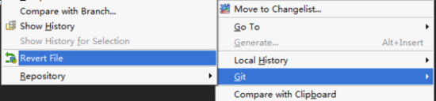

慎用，webstorm强大之处在于，自带代码本地编辑历史，如果你不慎把代码弄丢了，也可以找回来，后面会介绍。

### 如何提交代码到版本库？

在webstorm提交代码，相当于add+commit操作哦。

提交代码太常用了，一般明河设置快捷键“ctrl+c”。

菜单提交方法如下：

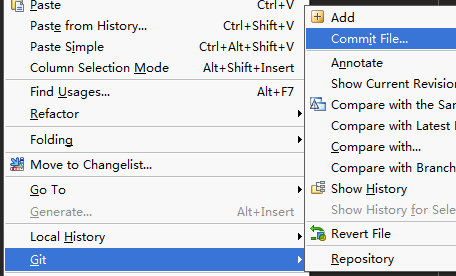

勾选你要提交的改动，写上commit记录即可。

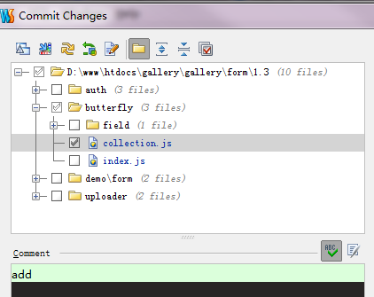

### 如何将新建的文件添加到版本库？

webstorm默认不会将新增文件添加到版本库中。

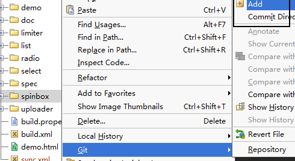

### 如何提交改动到远程版本库？

请确保github等远程版本库账号设置正确，机子上ssh key正确。

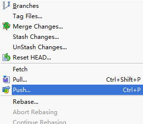

默认是master（本地） -&gt; origin/master（远程）

有时我们希望提交到远程分支，比如从 kf1.3（本地） -&gt; origin/1.3（远程）

多选框勾上，选择远程版本库，填写上分支名，点击刷新按钮即可。（如果远程版本库不存在这个分支，会创建一个）。

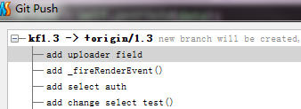

从远程版本库拉取代码比较简单，明河不再演示。

## 本地历史功能

非常实用的功能，是找回代码的好办法。

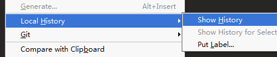

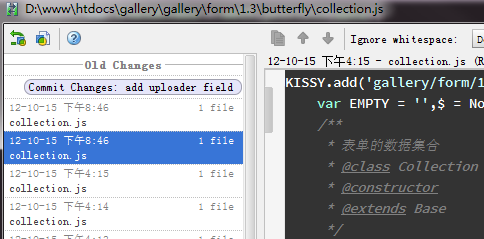