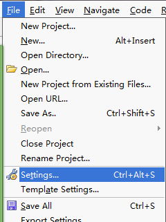
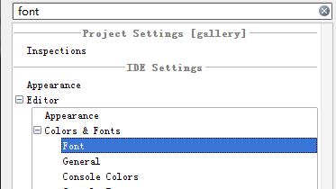
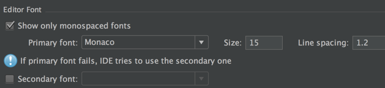
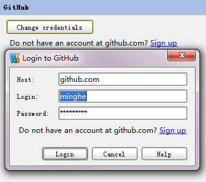
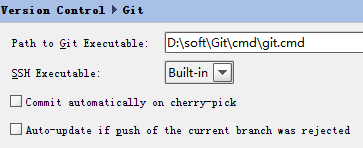
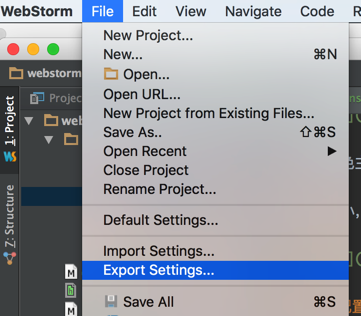
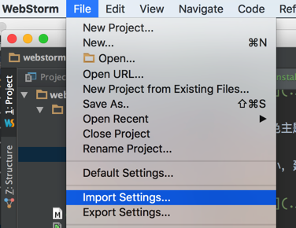

# 配置

从 [webstorm](https://www.jetbrains.com/webstorm/download/) 官网下载对应系统的安装包，webstorm 有 30 天的免费试用期，建议购买，不想购买网上也有注册机资源，可以自行搜索。

Webstorm 的默认字体和配色相当糟糕，你可以手动修改 Webstorm 的配置。

点击 “File” -> “Setting”：

Webstorm 的配置项极其丰富，建议善用搜索，比如修改主题，只要输入 "color" ：

可以配置颜色主题与字体，建议使用 “darcula” 主题。

默认字号偏小，建议修改成 15，同时加大行间距：

### git 配置

进入 Webstorm 的配置界面，搜索 github ，添加自己的 github 账号：

如果您的 webstorm 报 “找不到 git” 的错误，可以点击 “fix it”：

重新指向下 git 程序的路径。

### 配置的导出与导入

Webstorm 的配置可以导出备份或分享给其他人导入。

导出配置：

导出配置：

