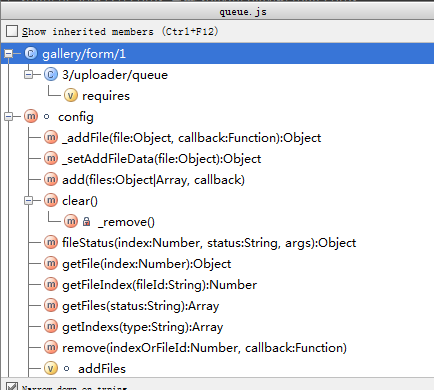
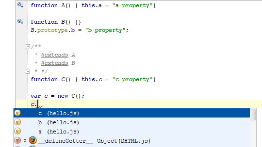
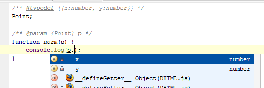

# 利用 jsdoc 提高自动提示

Webstorm拥有非常强大的自动提示功能，但 javascript 太灵活了，又是弱类型语言，提示的准确度和详细度依然是个问题（比如，一个带参数的函数，Webstorm无法提示出参数的数据类型）。

Webstorm5.0 引入**JSdoc的标签**支持，通过开发者自己给代码加上符合jsdoc要求的注释，来达到强化js自动提示的目标。

随便写个类，没加任何jsdoc注释时：

    function User(name){
          this.name=  name;
    }
    User.prototype = {
      render:function(){
    
      },
      getMoney:function(money){
        return money;
      }
    };

外部调用之：

    var minghe = new User('明河');
    minghe.getMoney(1000);

在写这二行中，Webstorm给出 User 类和 getMoney 的提示，但如果 getMoney 的参数数据类型只能是数值型，Webstorm 没给出对应的提示。

接下来我们给 getMoney 这个函数加上jsdoc。

（PS：Webstorm非常的知心，当你写好函数时候，输入“/**”加回车，会自动生成 jsdoc 格式的注释）

     /**
     *
     * @param money
     * @return {*}
     */
      getMoney:function(money){
        return money;
      }

我们补充些限制上去：

     /**
     *
     * @param {Number} money 一个屌丝能有多少钱
     * @return {Number}
     */
      getMoney:function(money){
        return money;
      }

做个测试：外部传入一个字符串作为参数

提示你传入的参数不是数值型！！

上面明河只是举了个简单的例子，来看下其他的demo。

先来看下一个带完成jsdoc注释的类，[uploader中的queue](https://github.com/KF-kissyForm/butterfly/blob/master/gallery/form/1.3/uploader/queue.js)。

利用jsdoc可以强化 Structure 的类成员的索引,有jsdoc补充后，Structure 变得非常方便，我现在我用它来快速定位代码。

使用 **ctrl+F12** 快速打开 Structure 界面。

### @extends ：用于类继承关系的声明

### @typedef：用于复杂数据类型的声明

