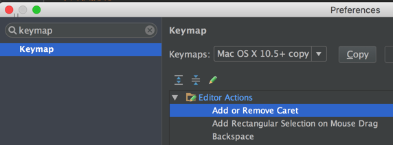
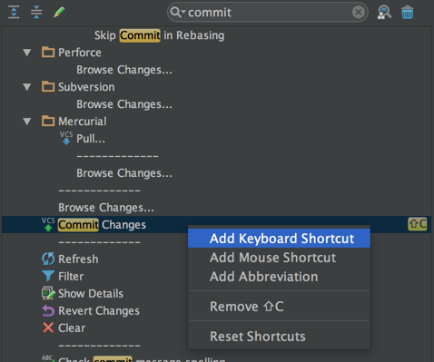

# 快捷键

查看快捷键，在设置界面中搜索 "keymap"：

## 设置自己的快捷键

比如将代码变更 commit ，webstorm 默认是没有配置快捷键的，我们设置个 shift + c 。

搜索 commit ：

找到操作项后，添加个新的快捷键，如果快捷键有冲突，webstorm 会有提示。

## 默认配置下的常用快捷键

mac book 下文的 ctrl 替换成 command 键。

<h3>查找/代替</h3>

<table border="0" cellspacing="0" cellpadding="0" class="tab1">
    <colgroup>
        <col width="160">
        <col>
    </colgroup>
    <thead>
    <tr>
        <td valign="top">
            
<strong>快捷键</strong>

        </td>
        <td valign="top">
            
<strong>说明</strong>

        </td>
    </tr>
    </thead>
    <tbody>
    <tr>
        <td valign="top"><strong>ctrl+shift+N</strong></td>
        <td valign="top">通过文件名快速查找工程内的文件（必记）</td>
    </tr>
    <tr>
        <td valign="top"><strong>ctrl+shift+alt+N</strong></td>
        <td valign="top">通过一个字符快速查找位置（必记）</td>
    </tr>
    <tr>
        <td valign="top"><strong>ctrl+F</strong></td>
        <td valign="top">在文件内快速查找代码</td>
    </tr>
    <tr>
        <td valign="top"><strong>F3</strong></td>
        <td valign="top">查找下一个</td>
    </tr>
    <tr>
        <td valign="top"><strong>shift+F3</strong></td>
        <td valign="top">查找上一个</td>
    </tr>
    <tr>
        <td valign="top"><strong>ctrl+R</strong></td>
        <td valign="top">文件内代码替换</td>
    </tr>
    <tr>
        <td valign="top"><strong>ctrl+shift+R</strong></td>
        <td valign="top">指定目录内代码批量替换</td>
    </tr>
    <tr>
        <td valign="top"><strong>ctrl+shift+F</strong></td>
        <td valign="top">指定目录内代码批量查找</td>
    </tr>
    <tr>
        <td valign="top"><strong>ctrl+R</strong></td>
        <td valign="top">文件内代码替换</td>
    </tr>
    </tbody>
</table>
<h3>界面操作</h3>
<table border="0" cellspacing="0" cellpadding="0" class="tab1">
    <colgroup>
        <col width="160">
        <col>
    </colgroup>
    <thead>
    <tr>
        <td valign="top">
            
<strong>快捷键</strong>

        </td>
        <td valign="top">
            
<strong>说明</strong>

        </td>
    </tr>
    </thead>
    <tbody>
    <tr>
        <td valign="top"><strong>ctrl+shift+A</strong></td>
        <td valign="top">快速查找并使用编辑器所有功能（必记）</td>
    </tr>
    <tr>
        <td valign="top"><strong>alt+[0-9]</strong></td>
        <td valign="top">快速拆合功能界面模块</td>
    </tr>
    <tr>
        <td valign="top"><strong>ctrl+shift+F12</strong></td>
        <td valign="top">最大区域显示代码（会隐藏其他的功能界面模块）</td>
    </tr>
    <tr>
        <td valign="top"><strong>alt+shift+F</strong></td>
        <td valign="top">将当前文件加入收藏夹</td>
    </tr>
    <tr>
        <td valign="top"><strong>ctrl+alt+s</strong></td>
        <td valign="top">打开配置窗口</td>
    </tr>
    <tr>
        <td valign="top"><strong>ctrl+tab</strong></td>
        <td valign="top">切换代码选项卡（还要进行此选择，效率差些）</td>
    </tr>
    <tr>
        <td valign="top"><strong>alt+&lt;-或-&gt;</strong></td>
        <td valign="top">切换代码选项卡</td>
    </tr>
    </tbody>
</table>
<table border="0" cellspacing="0" cellpadding="0" class="tab1">
    <colgroup>
        <col width="160">
        <col>
    </colgroup>
    <thead>
    <tr>
        <td valign="top">
            
<strong>快捷键</strong>

        </td>
        <td valign="top">
            
<strong>说明</strong>

        </td>
    </tr>
    </thead>
    <tbody>
    <tr>
        <td valign="top"><strong>ctrl+shift+N</strong></td>
        <td valign="top">通过文件名快速查找工程内的文件（必记）</td>
    </tr>
    <tr>
        <td valign="top"><strong>ctrl+shift+alt+N</strong></td>
        <td valign="top">通过一个字符快速查找位置（必记）</td>
    </tr>
    <tr>
        <td valign="top"><strong>ctrl+F</strong></td>
        <td valign="top">在文件内快速查找代码</td>
    </tr>
    <tr>
        <td valign="top"><strong>F3</strong></td>
        <td valign="top">查找下一个</td>
    </tr>
    <tr>
        <td valign="top"><strong>shift+F3</strong></td>
        <td valign="top">查找上一个</td>
    </tr>
    <tr>
        <td valign="top"><strong>ctrl+R</strong></td>
        <td valign="top">文件内代码替换</td>
    </tr>
    <tr>
        <td valign="top"><strong>ctrl+shift+R</strong></td>
        <td valign="top">指定目录内代码批量替换</td>
    </tr>
    <tr>
        <td valign="top"><strong>ctrl+shift+F</strong></td>
        <td valign="top">指定目录内代码批量查找</td>
    </tr>
    <tr>
        <td valign="top"><strong>ctrl+R</strong></td>
        <td valign="top">文件内代码替换</td>
    </tr>
    </tbody>
</table>
<h3>界面操作</h3>
<table border="0" cellspacing="0" cellpadding="0" class="tab1">
    <colgroup>
        <col width="160">
        <col>
    </colgroup>
    <thead>
    <tr>
        <td valign="top">
            
<strong>快捷键</strong>

        </td>
        <td valign="top">
            
<strong>说明</strong>

        </td>
    </tr>
    </thead>
    <tbody>
    <tr>
        <td valign="top"><strong>ctrl+shift+A</strong></td>
        <td valign="top">快速查找并使用编辑器所有功能（必记）</td>
    </tr>
    <tr>
        <td valign="top"><strong>alt+[0-9]</strong></td>
        <td valign="top">快速拆合功能界面模块</td>
    </tr>
    <tr>
        <td valign="top"><strong>ctrl+shift+F12</strong></td>
        <td valign="top">最大区域显示代码（会隐藏其他的功能界面模块）</td>
    </tr>
    <tr>
        <td valign="top"><strong>alt+shift+F</strong></td>
        <td valign="top">将当前文件加入收藏夹</td>
    </tr>
    <tr>
        <td valign="top"><strong>ctrl+alt+s</strong></td>
        <td valign="top">打开配置窗口</td>
    </tr>
    <tr>
        <td valign="top"><strong>ctrl+tab</strong></td>
        <td valign="top">切换代码选项卡（还要进行此选择，效率差些）</td>
    </tr>
    <tr>
        <td valign="top"><strong>alt+&lt;-或-&gt;</strong></td>
        <td valign="top">切换代码选项卡</td>
    </tr>
    <tr>
        <td valign="top"><strong>ctrl+F4</strong></td>
        <td valign="top">关闭当前代码选项卡</td>
    </tr>
    </tbody>
</table>
<h3>代码编辑</h3>
<table border="0" cellspacing="0" cellpadding="0" class="tab1">
    <colgroup>
        <col width="160">
        <col>
    </colgroup>
    <thead>
    <tr>
        <td valign="top">
            
<strong>快捷键</strong>

        </td>
        <td valign="top">
            
<strong>说明</strong>

        </td>
    </tr>
    </thead>
    <tbody>
    <tr>
        <td valign="top"><strong>ctrl+D</strong></td>
        <td valign="top">复制当前行</td>
    </tr>
    <tr>
        <td valign="top"><strong>ctrl+W</strong></td>
        <td valign="top">选中单词</td>
    </tr>
    <tr>
        <td valign="top"><strong>ctrl+&lt;-或-&gt;</strong></td>
        <td valign="top">以单词作为边界跳光标位置</td>
    </tr>
    <tr>
        <td valign="top"><strong>alt+Insert</strong></td>
        <td valign="top">新建一个文件或其他</td>
    </tr>
    <tr>
        <td valign="top"><strong>ctrl+alt+L</strong></td>
        <td valign="top">格式化代码</td>
    </tr>
    <tr>
        <td valign="top"><strong>shift+tab/tab</strong></td>
        <td valign="top">减少/扩大缩进（可以在代码中减少行缩进）</td>
    </tr>
    <tr>
        <td valign="top"><strong>ctrl+Y</strong></td>
        <td valign="top">删除一行</td>
    </tr>
    <tr>
        <td valign="top"><strong>shift+enter</strong></td>
        <td valign="top">重新开始一行（无论光标在哪个位置）</td>
    </tr>
    </tbody>
</table>
<h3>导航</h3>
<table border="0" cellspacing="0" cellpadding="0" class="tab1">
    <colgroup>
        <col width="160">
        <col>
    </colgroup>
    <thead>
    <tr>
        <td valign="top">
            
<strong>快捷键</strong>

        </td>
        <td valign="top">
            
<strong>说明</strong>

        </td>
    </tr>
    </thead>
    <tbody>
    <tr>
        <td valign="top"><strong>esc</strong></td>
        <td valign="top">进入代码编辑区域</td>
    </tr>
    <tr>
        <td valign="top"><strong>alt+F1</strong></td>
        <td valign="top">查找代码在其他界面模块的位置，颇为有用</td>
    </tr>
    <tr>
        <td valign="top"><strong>ctrl+G</strong></td>
        <td valign="top">到指定行的代码</td>
    </tr>
    <tr>
        <td valign="top"><strong>ctrl+]/[</strong></td>
        <td valign="top">光标到代码块的前面或后面</td>
    </tr>
    <tr>
        <td valign="top"><strong>alt+up/down</strong></td>
        <td valign="top">上一个/下一个方法</td>
    </tr>
    </tbody>
</table>
<h3>建议配置版本控制快捷键</h3>
<table border="0" cellspacing="0" cellpadding="0" class="tab1">
    <colgroup>
        <col width="160">
        <col>
    </colgroup>
    <thead>
    <tr>
        <td valign="top">
            
<strong>快捷键</strong>

        </td>
        <td valign="top">
            
<strong>说明</strong>

        </td>
    </tr>
    </thead>
    <tbody>
    <tr>
        <td valign="top"><strong>ctrl+C</strong></td>
        <td valign="top">提交代码</td>
    </tr>
    <tr>
        <td valign="top"><strong>ctrl+p</strong></td>
        <td valign="top">向远程版本库推送更新</td>
    </tr>
    <tr>
        <td valign="top"><strong>ctrl+G</strong></td>
        <td valign="top">到指定行的代码</td>
    </tr>
    <tr>
        <td valign="top"><strong>ctrl+]/[</strong></td>
        <td valign="top">光标到代码块的前面或后面</td>
    </tr>
    <tr>
        <td valign="top"><strong>alt+up/down</strong></td>
        <td valign="top">上一个/下一个方法</td>
    </tr>
    </tbody>
</table>
