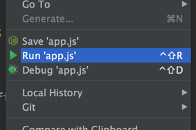
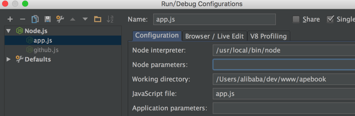
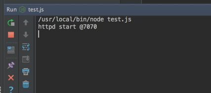
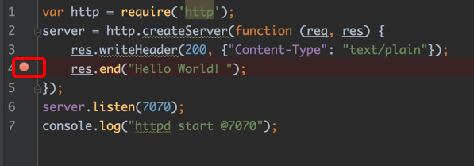
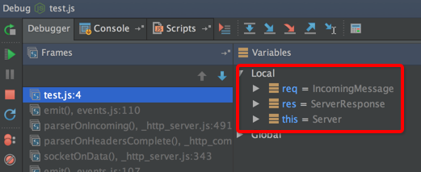

# Nodejs

Webstorm作为个javascript的IDE，提供了最天然的NodeJs支持，在Webstorm中，您可以运行、调试、自动提示NodeJs。

## Webstorm 对 NodeJs 的支持

随便建个demo工程，建个 **test.js**，代码如下：

    var http = require('http');
    server = http.createServer(function (req, res) {
    res.writeHeader(200, {"Content-Type": "text/plain"});
    res.end("Hello World！");
    });
    server.listen(7070);
    console.log("httpd start @7070");

创建一个http请求，打印出”Hello World！”字符串。

有多种方式可以将工程配置成Nodejs工程，最简单的方式如下：

在代码区域，右键点击下

采用默认的配置创建个nodejs服务器

使用“ctrl+shift+F10”，运行Node脚本：

从上图可以看到Webstorm集成了Node控制台，可以直接打印出Node消息。

##### 断点调试Node

断点功能非常实用，堪称调试利器。

在你需要打断点的代码行前面点击下即可：

使用快捷键“shift+F9”，开始debug：

浏览器访问 http://localhost:7070 ，就会被断到，可以查看此时上下文内容。
