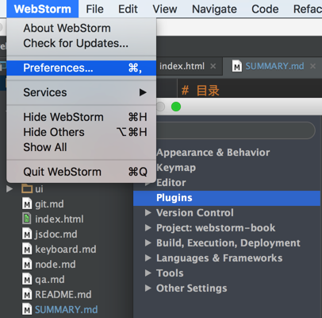
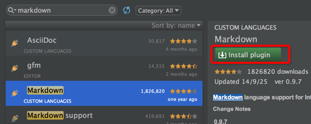
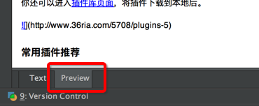
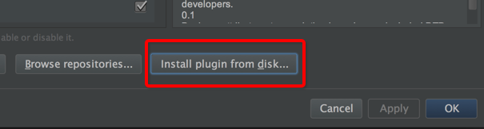

# 插件的使用

（本章内容原稿已经遗失，15.12.30 新增内容）

Webstorm 的插件丰富程度无法跟 eclipse、sublime text、vim 相比，但 Webstorm 本身就足够强大，并不大需要安装太多插件。

下面以 Markdown 预览插件的安装讲解如何安装插件。

### 通过 IDE 直接安装插件

进入 “Preferences” ，搜索 “plugins” ，进入插件页面：

搜索 markdown 关键字，如果您的编辑没有，会显示找不到的提示，然后点击 “browse” 链接，查找插件库：

安装完成后，按照提示 restart 重启编辑即可。

### 从网页插件库下载插件

有时插件下载非常慢，忍不了，可以进入[插件库页面](http://plugins.jetbrains.com/webStorm)，将插件下载到本地后安装。

找到 [markdown 插件](http://plugins.jetbrains.com/plugin/5970?pr=webStorm) 下载。

导入到编辑器中：

### 常用插件推荐

除了上文提到的 [markdown 插件](http://plugins.jetbrains.com/plugin/5970?pr=webStorm) 还建议安装下面几个插件：

**[IdeaVim](http://plugins.jetbrains.com/plugin/164?pr=webStorm)**

让编辑器支持vim的快捷键！

**[.ignore](http://plugins.jetbrains.com/plugin/7495?pr=webStorm)**

让编辑器支持 ignore 的高亮与错误提示，支持 .gitignore (GIT), .hgignore (Mercurial), .npmignore (NPM), .dockerignore (Docker), .chefignore (Chef), .cvsignore (CVS), .bzrignore (Bazaar), .boringignore (Darcs), .mtn-ignore (Monotone), ignore-glob (Fossil), .jshintignore (JSHint), .tfignore (Team Foundation), .p4ignore (Perforce), .flooignore (Floobits) 。

**[TabSwitch](http://plugins.jetbrains.com/plugin/179?pr=webStorm)**

快速切换代码文件选项卡。

**[eslint](http://plugins.jetbrains.com/plugin/7494?pr=webStorm)**

ESLint 检查器支持。

**[AceJump](http://plugins.jetbrains.com/plugin/7086?pr=webStorm)**

快速定位光标位置，提高光标定位效率的神器。

**[Key Promoter](http://plugins.intellij.net/plugin/?webide&amp;pluginId=4455)**

快捷键提示插件，帮助你快速记住快捷键。当你用鼠标完成某功能时，它会指示有相应的快捷键来完成刚才的功能，同时指导你为经常重复的操作建立快捷键。

**[AltN8](http://plugins.intellij.net/plugin?pr=webide&amp;pluginId=1475)**

非常强大的插件，用于快速打开的文件（自行编写正则）

