# 代码模板

Webstorm的模版功能非常强大，懒人必备。

<h2>File Templates：文件模版</h2>

使用“ctrl+shift+a”，搜索File Templates：

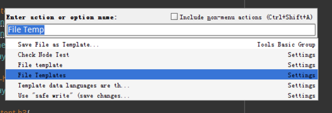

会打开如下窗口：

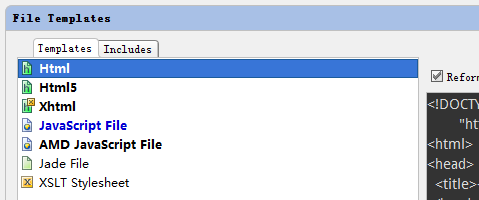

接下来以新建个kissy模块文件为例：

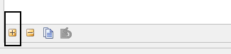

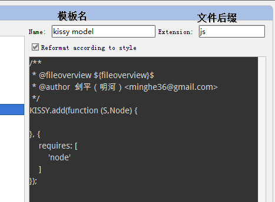

<h3>额外给模版注入变量</h3>

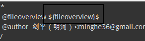

变量名可以自定义，以<strong>${变量名}$</strong>这样的格式出现。

接下来我们来新建个文件试试。

使用“alt+insert”，打开新建文件列表：

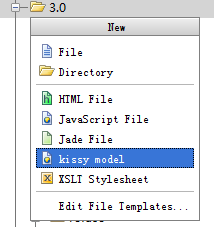

可以看到，已经出现了“kissy model”模版，选择之，会出现一个变量填写对话框：

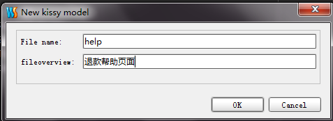

这样就可以快速新建指定文件了，当然你也可以修改已经存在的文件模版。

<h2>Live Templates：优秀的代码片段模版</h2>

Live Templates是非常实用的功能，严重推荐大家在日常工作中用起来。

使用“ctrl+shift+a”，搜索“live”：

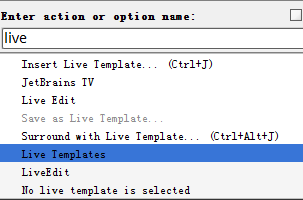

会打开如下界面：

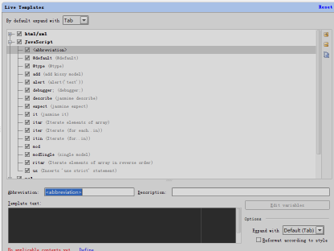

左侧会有个新建按钮，接下来我们来新建个常用的<strong>debugger;</strong>片段试试。

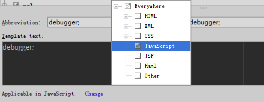

特别留意底部的有个live template出现的文件类型设置，是必须选择的。

<h3>如何插入代码片段呢？</h3>

在代码区域，输入“d”（不需要输入完成的模版名），然后使用“ctrl+J”：

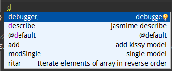

就可以找到我们之前新建的<strong>debugger</strong>模版。

<h3>如何在模版中加入变量呢？</h3>

webstorm的live template是可以加入变量的，来体会下这个功能。

以新建一个kissy的模块模版为例。

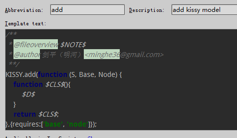

模版代码如下：

    /**
     * @fileoverview $NOTE$
     * @author 剑平（明河）<minghe36@gmail.com>
     **/
    KISSY.add(function (S, Base, Node) {
        function $CLS$(){
            $D$
        }
        return $CLS$;
    },{requires:['base', 'node']});

变量以<code>$变量名$</code>这样的形式出现。

当你插入模版的使用，可以使用“tab”键切光标到变量位置，而且如果模版内这个变量出现多次，你只要输入一次变量值，所有地方都改变，非常的方便。
