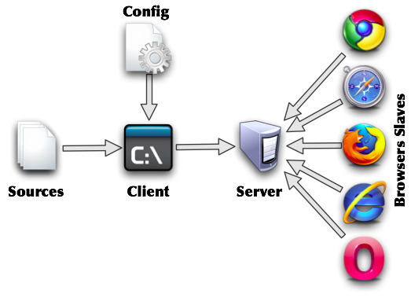
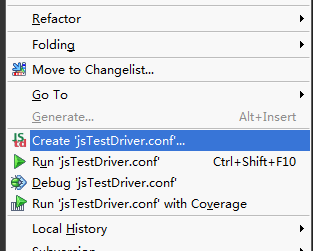
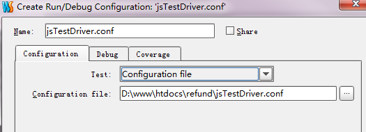
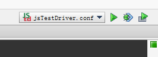
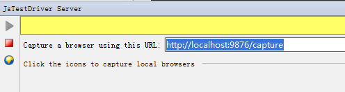
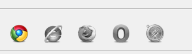
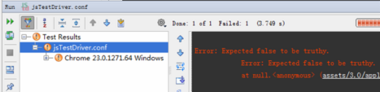

# JsTestDriver 的使用

JsTestDriver 是 javascript 单元测试工具，webstorm 集成了 JsTestDriver ，可以直接使用。

#### 1.在你的根目录中插入JsTestDriver的配置文件jsTestDriver.conf

内容可能如下：（根据本机目录的实际情况配置）

    server: http://localhost:9876
    load:
      - assets/3.0/tools/jasmine/jasmine.js
      - assets/3.0/tools/jasmine/jasmineAdapter.js
      - assets/3.0/tools/jasmine/jasmine-html.js
    test:
    - assets/3.0/apply/1.0/test/*.js

*   server：服务器路径
*   load：依赖脚本，会在test指定的脚本执行前执行
*   test：测试脚本

JsTestDriver 简单原理说明：将 load 和 test 的脚本移到启动的 server 服务器上，然后在各个浏览器中运行服务器的脚本，最后将单测得结果集返回给 Webstorm。

使用 JsTestDriver 的注意点：

*   测试脚本所依赖的所有文件，必须指定；
*   JsTestDriver的测试运行页面是自己创建的，没办法自己指定（这点蛋疼，会造成很多困难）；
*   在ajax的测试中要特别注意，你需要mock方法，不然会出现无法获取数据，导致单测无法进行的问题；
*   JsTestDriver如果使用其他单测类库比如jasmine，需要适配器

#### 2.在工程内引入JsTestDriver

在代码界面右击，寻找到下面的菜单项：

打开创建界面后，指定下配置文件路径：

成功后，右上角会出现JsTestDriver的信息：

#### 3.使用jasmine

jasmine应该是最被广泛使用的js单测类库，所以明河以jasmine的单测运行为例，而不是JsTestDriver（这里指的是JsTestDriver内置的单测类库）。

配置load，引入jasmine和jasmineAdapter：

    server: http://localhost:9876
    load:
      - assets/3.0/tools/jasmine/jasmine.js
      - assets/3.0/tools/jasmine/jasmineAdapter.js
      - assets/3.0/tools/jasmine/jasmine-html.js

这三个文件可以在[明河的代码库](https://github.com/minghe/jasmine-kissy)中找到。

随便写个测试代码：

    server: http://localhost:9876
    test:
    - assets/3.0/apply/1.0/test/*.js

内容如下：
    
    describe('this is a demo',function(){
         it('demo it',function(){
            expect(false).toBeTruthy();
         })
    });

#### 4.运行JsTestDriver

使用快捷键“shift+F10”

有可能会因为缺少服务器路径配置，导致运行失败，没关系，在右下角打开JsTestDriver的界面，填写上url（http://localhost:9876）

点亮浏览器（点击灰色的浏览器图标）：

再按“shift+F10”运行之，如果出现类似以下界面，说明运行成功：

Webstorm的确强大，给我们提供了众多便利，就单元测试而言JsTestDriver只是第一步，关键还是开发者将单元测试写起来！以后会给大家分享单测代码层面的最佳实践。