# 工程和界面

## Webstorm中的工程

### 1.新建工程

点击顶部菜单栏“File”-&gt; “New Project”。

弹出如下界面：

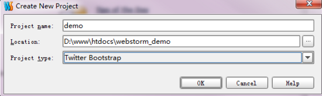

“Location”指向想要创建的工程目录（如果该目录已经存在文件，会出现exist提示，没关系，直接下一步即可）。

“Project Type”为工程类型，应该理解为工程模版更合适，默认为空项目，Webstorm支持html5、bootstrap、NodeJs、express工程模版。

这里我们选择流行的“Bootstrap”，点击下一步后，Webstorm会自动从服务器拉取Bootstrap的代码（源代码）到工程目录内。

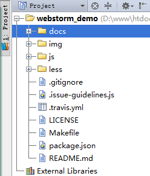

Webstorm的工程缺陷在于**没办法在一个界面中存在多个工程**，再新建个工程，会打开个新的窗口，来回切换非常麻烦。

### 2.收藏夹功能

当工程目录很庞大时，有些子目录很经常打开，但层级又很深，这时候可以把目录添加到收藏夹里面，比如：

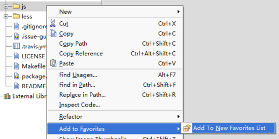

（需命名下收藏列表名称）

添加成功后，左侧有个“Favorites”菜单：

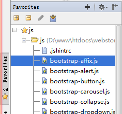

### 3.工程其他操作

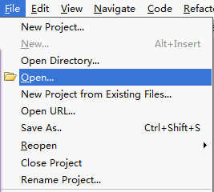

包括关闭工程、打开最近工程、重命名工程、打开工程等，比较简单，明河不再累述。

## Webstorm的主要界面

### 1.顶部菜单

包含所有IDE功能，后面的文章会讲解到常用的功能项。

建议看下功能菜单上的快捷键。

### 2.目录面包屑

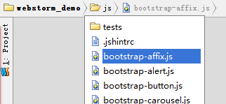

这个功能非常实用，可以通过点击目录来寻找需要的文件，比打开工程界面来得节约空间，够低碳。

### 3.工程界面

在Webstorm中用于查找文件的功能有很多，在工程界面界面中查找是最原始的，效率也是最差的，打开后还占用代码窗口面积。

建议使用“alt+1”来快速拆合工程界面。

### 4.构造器界面

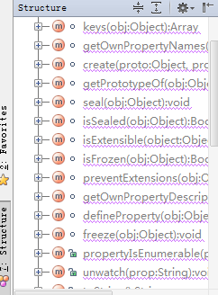

在这个界面中，可以快速查找js类的函数和对象，留意准确度跟你的注释量息息相关（注释需要符合jsdoc格式，这个后面会讲道）。

### 5.todo界面

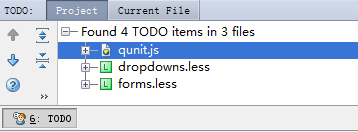

给代码加todo注释，是个非常好的习惯，比如提醒后面的维护者要注意些什么，比如提醒日后的自己要优化这处的代码等。

菜单项前面的6,，表示你可以使用”alt+6″来快速拆合此界面。

给代码加todo很简单：`// TODO why??`类似这样既可。

### 6.底部信息

数字区域表示的是光标位置，有个实用的技巧：点击这个区域，可以跳转到指定行的代码：

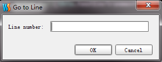

底部还可以设置文件的编码。

### 7.显示代码行数

右击代码界面左侧边框任意位置：

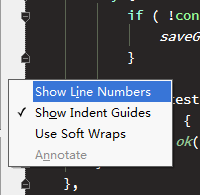

左侧边框还会有代码版本变更标记，非常实用。

### 8.工程环境配置

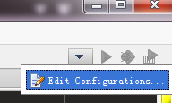

后面会详细讲解这部分内容。

### 9.隐藏边栏菜单

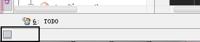

点击左底下的关闭按钮。

### 10.快速拆合界面

可以使用“alt+数字键”来快速拆合界面。

如何查看界面的数字键呢？

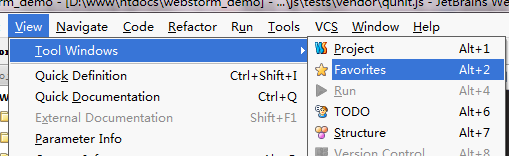

### 11.隐藏菜单和工具栏

点击“View”

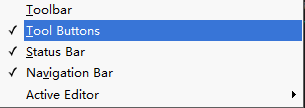

### 12.双栏代码界面

右击代码选项卡上的文件

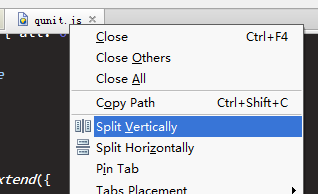